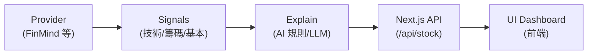

# 台股波段健康/多空儀表板 (Taiwan Stock Health Dashboard)

這個專案是一個台股儀表板，用來快速檢查個股的波段多空趨勢與體質。我們從技術面、籌碼面、基本面三個維度切入給出分數，並透過 AI 統整出一份簡短的總結報告。

## 🌟 Demo
> 🔗 **[Vercel Demo URL](https://tw-stock-health-dashboard.vercel.app/)**

## 📸 核心功能
- **Dashboard**: 一眼看出 5 檔自選股的三大面向分數與 AI 解讀。
- **Watchlist**: 自選股清單直接存在瀏覽器的 LocalStorage 裡，不用登入。
- **Reports**: 每日自動產生大盤或個股的文字簡報。

## 🏗️ 系統架構



### Telegram 機器人整合 (互動指令 `/daily` & `/stock`)
最新版本現已支援雙向的 Telegram 小幫手：
1. **GitHub Actions 主動推播**：每日收盤後自動發送極簡總覽至指定群組。
2. **Vercel Webhook 互動查詢**：群組成員可隨時下指令查詢最新報告，報告內容 100% 來自 Actions 產出的 `reports/YYYY-MM-DD-watchlist.json`，確保數據完全一致。

**【部署教學】**
- **GitHub Secrets** (供 Actions 推播):
  - `TELEGRAM_BOT_TOKEN`:向 @BotFather 申請的機器人 Token。
  - `TELEGRAM_CHAT_ID`:推播目標群組或個人的 Chat ID。
  - `WATCHLIST_TW` (選填): "2330,8299,2867"
- **Vercel Env Variables** (供 Webhook 解析):
  - `TELEGRAM_BOT_TOKEN`: 同上。
  - `GITHUB_OWNER`: 你的 GitHub 帳號名。
  - `GITHUB_REPO`: `tw-stock-health-dashboard`。
  - `GITHUB_PAT` (選填): 右上角設定申請的 Personal Access Token (若 Repo 為 Private 必填)。
  
**【註冊 Webhook】**
在你將 Vercel 發布完成後，開啟終端機執行一次以下指令，將你的 Vercel API 綁定到 Telegram：
```bash
curl -F "url=https://<你的 Vercel 網域>/api/telegram/webhook" https://api.telegram.org/bot<你的TELEGRAM_BOT_TOKEN>/setWebhook
```

## 🛠 自動測試與診斷

專案裡有寫好的幾支腳本可以當作自我檢測，跑一下就能知道 API 有沒有壞掉、快取有沒有命裡，或是算出來的分數正不正常。像是台積電、鴻海、聯發科算出來的分數不應該都長得一樣：

```bash
npm run selfcheck
```

如果你只擔心營收等基本面 API 壞掉：
```bash
npm run selfcheck:fundamental
```

腳本跑完會在終端機印出詳細分數跟實際拿到的資料筆數，最後還會自動檢查 `flowScore` 和 `fundamentalScore` 的波動區間有沒有達到實務上能用的標準。如果 API 斷線或資料抓不到會直接噴警告。

## 📊 計分邏輯

### 📈 1. 趨勢分數 (Trend Score) - 0~100 分
看目前的技術面強弱：
- **40% 趨勢排列**: 檢查 20MA、60MA、120MA 目前是多頭還是空頭排隊。
- **20% RSI 動能**: RSI(14) 區間動能，大於 50 偏強，大於 70 留意超買風險。
- **20% MACD 柱狀**: 趨勢加速指標，紅柱會加分。
- **20% 波段報酬**: 最近 60 天內這檔股票幫你賺（或賠）了多少。

### 💰 2. 籌碼分數 (Flow Score) - 0~100 分
追蹤法人的大錢跟散戶動向：
- **外資買賣 (+/-25)**: 近 5 天與近 20 天外資淨買賣超狀況。
- **投信買賣 (+/-25)**: 近 5 天與近 20 天投信淨買賣超狀況。
- **融資餘額 (+/-10)**: 看看散戶有沒有過度熱情，如果近 20 天融資暴增，通常會直接扣分。

### 🏭 3. 基本面分數 (Fundamental Score) - 0~100 分
找尋有沒有實質的獲利數字在支撐股價：
- **YoY 平均**: 最近三個月份的單月營收年增率大約多少。
- **YoY 趨勢**: 營收成長是不是這幾個月持續在放大。

### 📰 4. 催化劑與新聞 (News Catalyst) - -100~100 分
- 透過 AI 分析近 7 天的新聞事件，標記出利多與利空消息。
- 判斷目前的市場關注焦點，快速總結成催化劑分數。

### ⚡ 5. 其他獨家指標
除了三大面向，我們還加上這些模組幫助決策：
- **波動敏感度 (Volatility)**: 偵測這幾天有沒有假突破或是被急拉急殺的機會。
- **策略建議 (Strategy)**: 定義好觸發條件和失效條件的具體操作建議，例如波段等待、短線偏多。
- **機率預測 (Probability)**: 基於過去歷史統計，推算未來 1/3/5 天可能上漲的校準機率與回檔風險。

---


## ⚠️ 免責聲明
> 此為開源專題展示 (Demo Project)，並非投資建議。\n> 上面的分數與訊號都是基於固定規則和歷史回測計算的結果，實際市場瞬息萬變。盈虧自負，下單前請動腦。
