# 📊 台股診斷 PRO (TW Stock Health Dashboard)

[](https://github.com/michaelbothsieh-crypto/tw-stock-health-dashboard)
[](https://nextjs.org/)
[](src/lib/ai/modelRouter.ts)
[](LICENSE)

**台股診斷 PRO** 是一款專為個人投資人與專業交易者打造的 **AI 量化決策輔助與戰術沙盤推演系統**。系統深度整合了技術面、籌碼流向、基本面財報、海外總經指標以及內部人持股異動，並透過獨創的 **3-Tier AI 備援架構**，在極低延遲下產出具備實戰指導價值的個股「IF-THEN」防守與進攻腳本。

本專案支援雙端互動：具備豐富視覺效果的 **Web Bento 戰情室**，以及功能強大、隨身攜帶的 **Telegram 智能助理**。

> 🌐 **線上展示畫面**：[https://tw-stock-health-dashboard.vercel.app/](https://tw-stock-health-dashboard.vercel.app/)
> 🤖 **Telegram 機器人**：支援台股/美股代號快速健檢、自定義回測與強勢股掃描。

---

## 🤖 3-Tier AI 備援架構 (Resilient AI Architecture)

為解決 API 速率限制（Rate Limits）與單點故障風險，本專案設計了 **3-Tier AI 容錯備援與自動路由機制** (`src/lib/ai/modelRouter.ts`)，確保系統在任何極端市況下皆能保持高可用性：

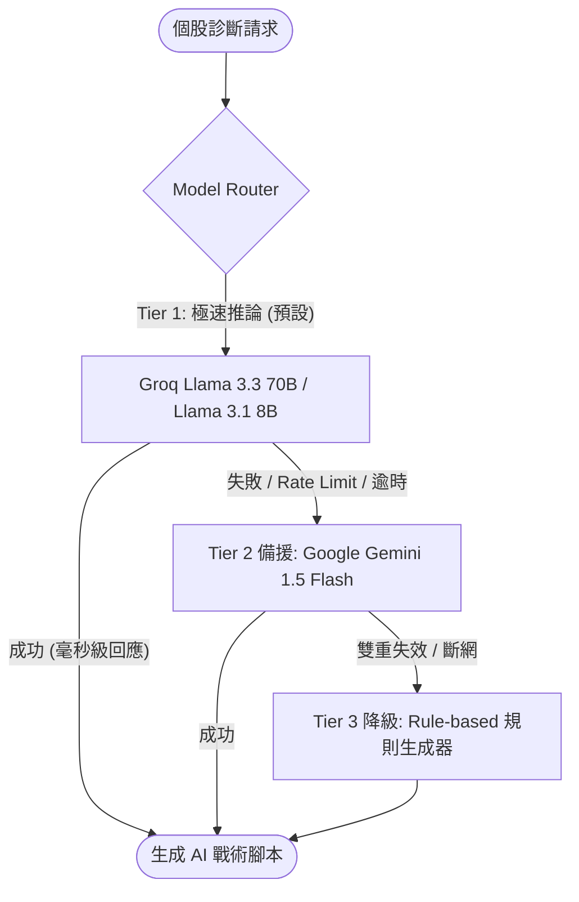
```mermaid
graph TD
    Request([個股診斷請求]) --> Router{Model Router}
    Router -- "Tier 1: 極速推論 (預設)" --> Tier1[Groq Llama 3.3 70B / Llama 3.1 8B]
    Tier1 -- "成功 (毫秒級回應)" --> Output([生成 AI 戰術腳本])
    Tier1 -- "失敗 / Rate Limit / 逾時" --> Tier2[Tier 2 備援: Google Gemini 1.5 Flash]
    Tier2 -- "成功" --> Output
    Tier2 -- "雙重失效 / 斷網" --> Tier3[Tier 3 降級: Rule-based 規則生成器]
    Tier3 --> Output
```

*   **Tier 1 (Groq)**：利用 Llama 3.3 70B / 3.1 8B 模型進行極速推理，提供最即時的台股俚語風格專業點評。
*   **Tier 2 (Gemini)**：當 Groq 觸發限制或異常時，無縫切換至 Google Gemini 1.5 Flash，保障診斷品質。
*   **Tier 3 (Rule-based)**：當所有外部 LLM API 皆無法連線時，啟動本地靜態規則評估器，確保核心決策數據與基本策略依然可用。

---

## 📊 資料流與量化引擎 (Data & Signal Flow Engine)

本系統具備高併發、低延遲的數據處理能力，透過以下高度解耦的管道（Pipeline）進行實時決策分析：

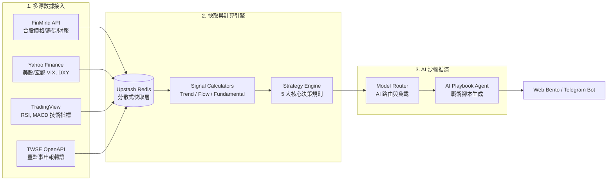
```mermaid
graph LR
    subgraph DataSources [1. 多源數據接入]
        FM[FinMind API<br>台股價格/籌碼/財報]
        YF[Yahoo Finance<br>美股/宏觀 VIX, DXY]
        TV[TradingView<br>RSI, MACD 技術指標]
        TWSE[TWSE OpenAPI<br>董監事申報轉讓]
    end

    subgraph CoreEngine [2. 快取與計算引擎]
        Cache[(Upstash Redis<br>分散式快取層)]
        Calc[Signal Calculators<br>Trend / Flow / Fundamental]
        Strategy[Strategy Engine<br>5 大核心決策規則]
    end

    subgraph AIStage [3. AI 沙盤推演]
        Router[Model Router<br>AI 路由與負載]
        Playbook[AI Playbook Agent<br>戰術腳本生成]
    end

    FM & YF & TV & TWSE --> Cache
    Cache --> Calc
    Calc --> Strategy
    Strategy --> Router
    Router --> Playbook
    Playbook --> UI[Web Bento / Telegram Bot]
```

### 📈 8 大評分維度 (Comprehensive Metrics)
系統不依賴單一指標，而是綜合計算 8 個核心維度產出雷達圖與最終健康分數：
1.  `trendScore` (技術趨勢分數)：結合多天期 SMA、RSI 與 MACD 強弱勢。
2.  `flowScore` (籌碼資金流向)：分析三大法人買賣超、融資融券增減比例。
3.  `fundamentalScore` (基本面分數)：評估本益比位階、營收成長率。
4.  `catalystScore` (催化劑/新聞情緒)：過濾近期重大事件與新聞情緒得分。
5.  `volatilityScore` (波動度風險)：衡量近期價格振幅與 ATR 乖離。
6.  `probability1D/3D/5D` (多天期上漲機率)：基於歷史勝率模型預測。
7.  `pullbackRisk` (拉回風險度)：高檔鈍化與超買程度評估。
8.  `consistencyScore` (量價配合度)：成交量與價格走勢的一致性。

---

## ⚔️ 策略引擎決策規則 (Strategy Engine)

位於 `src/lib/strategy/strategyEngine.ts` 的核心引擎根據量化指標實時匹配 5 條專業交易規則：

| 規則名稱 | 觸發條件 | 輸出策略方針 |
| :--- | :--- | :--- |
| **`rule_breakout_follow`** | 突破關鍵均線 + 成交量同步放大 | **短線強勢做多**：順勢追擊突破，設定嚴格移動停利。 |
| **`rule_pullback_buy`** | 中長線強趨勢 + 短線拉回均線支撐 + 籌碼法人買盤承接 | **波段逢低布局**：優質標的超跌，尋求支撐點分批進場。 |
| **`rule_news_event`** | 強催化劑事件觸發 + 波動度異常放大 | **事件驅動交易**：防範極端開高走低，鎖定隔日沖溢價。 |
| **`rule_flow_risk_off`** | 技術均線轉弱 + 法人連續賣超 + 融資高檔多頭不死 | **等待/減碼觀望**：籌碼失控且技術面崩壞，暫避鋒芒。 |
| **`rule_dead_cat_bounce`** | 中長線空頭趨勢 + 短期乖離過大超跌反彈 + 5日勝率偏低 | **反彈空頭陷阱**：假突破機率高，切忌追高，逢反彈減碼。 |

---

## ⚡ Telegram 智能助理 (Next-Gen Bot)

系統提供極速回應的 Telegram 互動介面，支援多項實用量化指令：
*   🔍 `/stock [代號]`：**台美股雙引擎健檢**。自動正規化輸入（如 `2330` 轉 `2330.TW`），輸出精美的個股分數卡片與 AI 點評。
*   🔥 `/hot [stock/etf]`：**熱門爆紅榜**。串接 Yahoo 社群數據，即時印出最受市場討論的熱門個股與 ETF。
*   📊 `/etf [代號]`：**成分股穿透**。全面解析 ETF 前十大持股權重、YTD 績效與折溢價狀況。
*   🏆 `/twrank` / `/usrank`：**強勢股篩選**。自動過濾成交量過低的水餃股，篩選出昨日動能最強的 10 檔精選標的。
*   📈 `/roi [代號] [期間]`：**自定義區間回測**。精準回測如 `1y`, `3y`, `YTD` 等天期的投資回報表現。
*   🤔 `/whatis [名稱/代號]`：**AI 公司百科**。秒懂公司的主要營收來源、核心護城河與近期關鍵催化劑事件。

---

## 📸 功能實景展示 (Gallery)

### 📊 戰術情報中心 (Web Dashboard)
| 核心戰情室 (Bento Dashboard) | 技術面溫度計 | 籌碼流向雷達 |
|:---:|:---:|:---:|
| 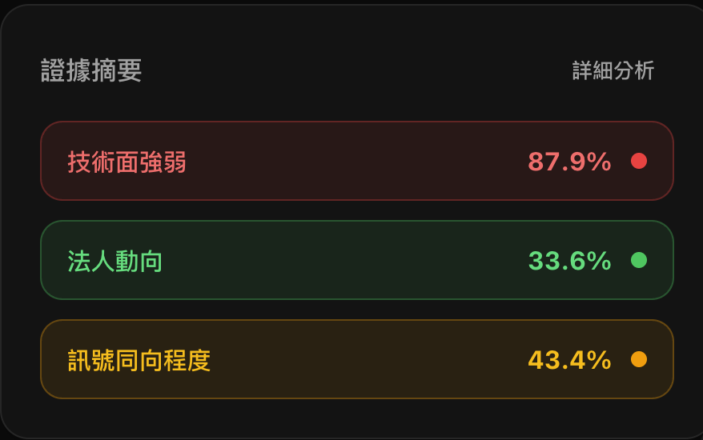 | 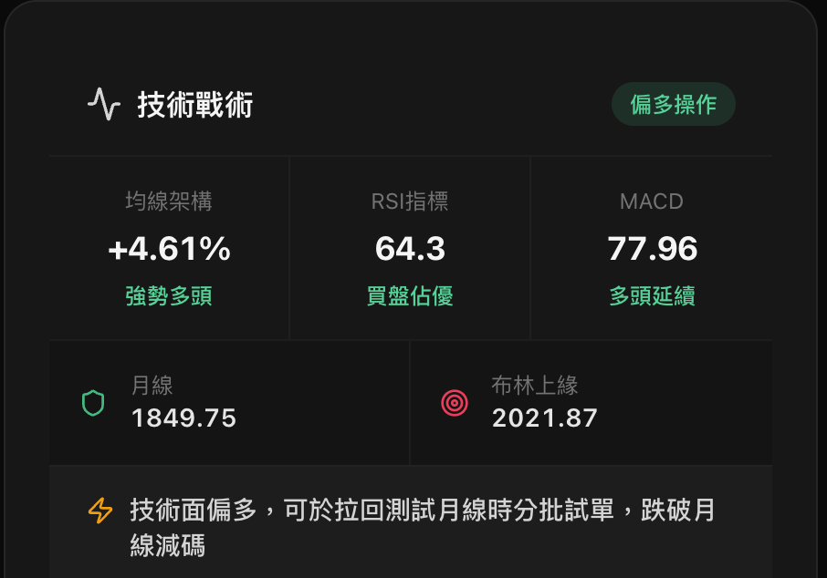 | 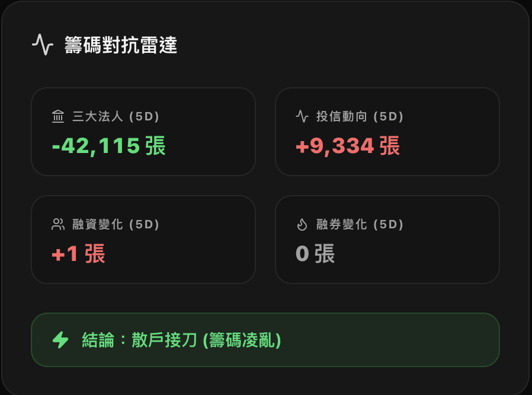 |

| 實戰腳本 (AI Playbook) | 全球宏觀連動監控 | 多維度評分雷達圖 |
|:---:|:---:|:---:|
| 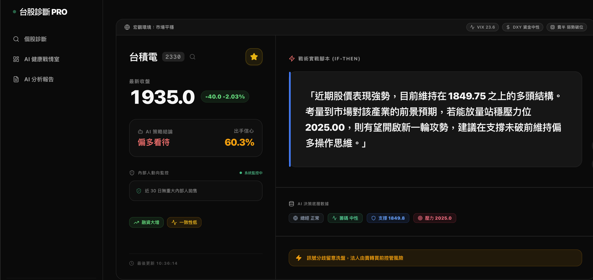 | 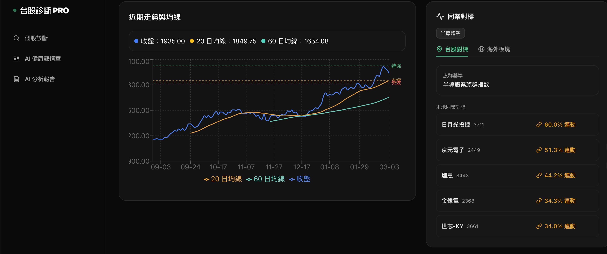 | 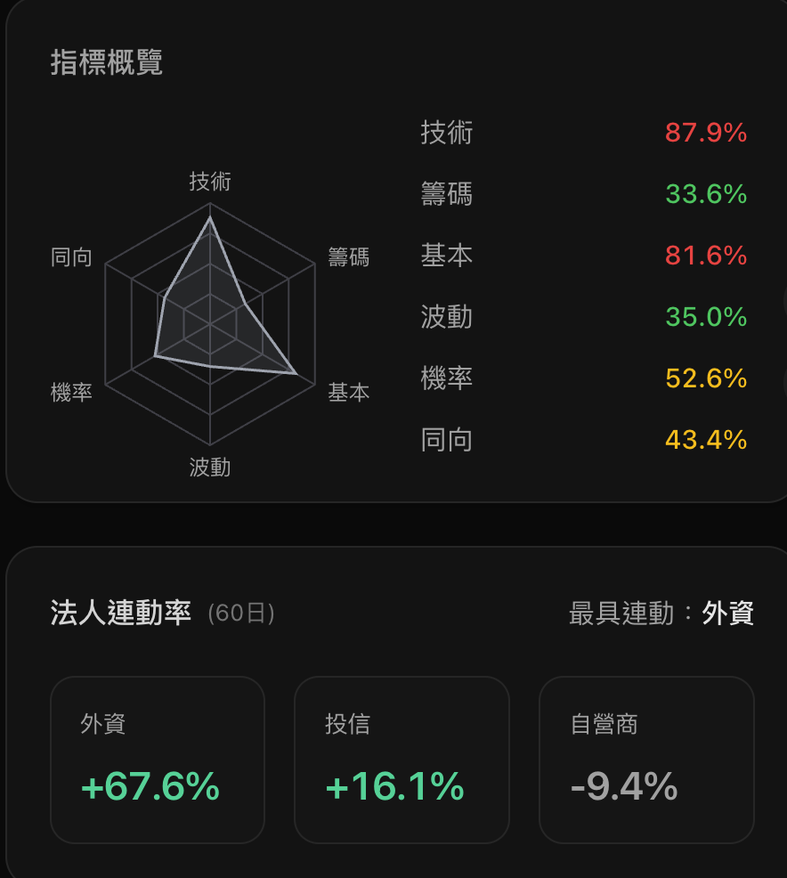 |

### ⚡ Telegram 智能助理 (Mobile Experience)
| 深度個股健檢卡片 | 自定義觀察名單 | 階段性能量分析 |
|:---:|:---:|:---:|
| 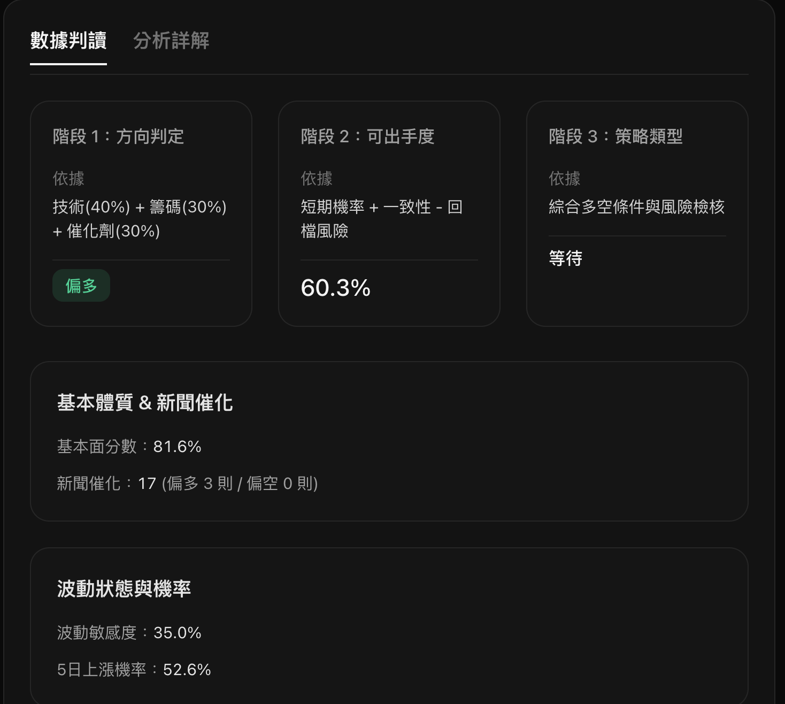 | 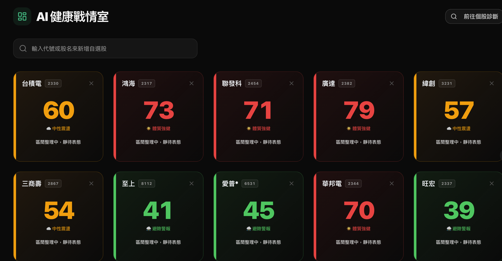 | 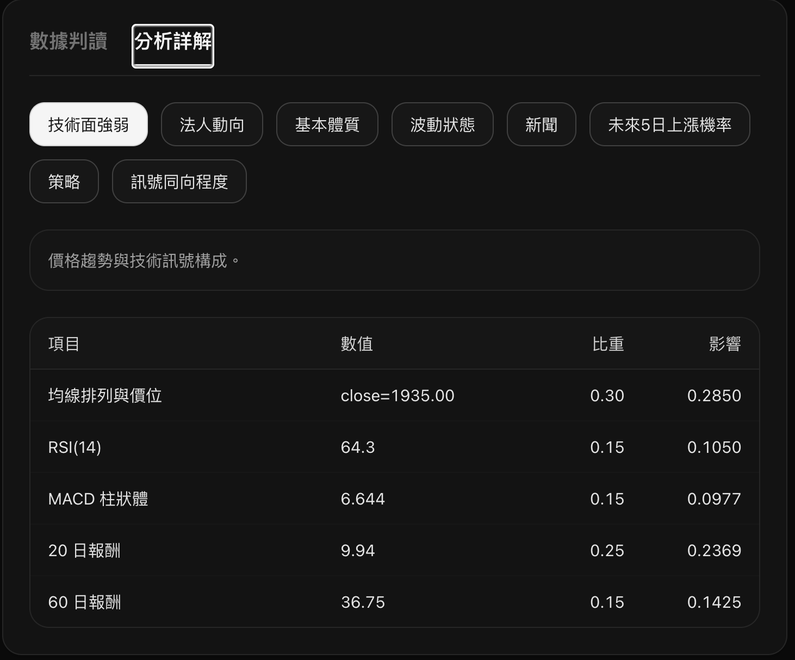 |

---

## 🏗️ 目錄結構與架構設計

```
src/
├── app/
│   ├── api/                    # API 路由 (Next.js Route Handlers)
│   │   ├── stock/[ticker]/     # snapshot (個股快照) + insider (內部人持股) API
│   │   ├── global/crash/       # 崩盤預警與總經壓力測試
│   │   ├── cron/daily-alert/   # Telegram 定時推播 Cron 機制
│   │   └── report/             # 每日自動化報告生成端點
│   └── stock/[ticker]/         # 個股詳情畫面 (動態路由)
├── components/
│   ├── dashboard/              # Bento Dashboard 主版面
│   ├── tiles/                  # 功能資料磚 (Technical, Flow, Macro)
│   └── charts/                 # Recharts 封裝的響應式圖表
├── lib/
│   ├── ai/                     # AI 模型路由、Playbook 戰術代理、Alert 生成
│   │   ├── playbookAgent.ts    # AI 沙盤推演核心
│   │   └── modelRouter.ts      # 3-Tier 自動容錯路由器
│   ├── signals/                # 技術、籌碼與基本面指標量化計算
│   │   ├── trend.ts            # 均線黃金交叉/死亡交叉、RSI、MACD 計算
│   │   ├── flow.ts             # 法人/融資資金流向計算
│   │   └── fundamental.ts      # 營收動能與本益比估值
│   ├── strategy/
│   │   └── strategyEngine.ts   # 5 大交易決策規則策略引擎
│   ├── providers/              # 數據供應器整合 (FinMind, Yahoo, TradingView, Redis)
│   └── news/                   # 財經新聞分類與情緒分析
├── hooks/                      # useStockSnapshot, useWatchlist 等自定義 React Hooks
└── data/twStockNames.ts        # 台股靜態公司資料庫
```

---

## ⚙️ 快速上手與本地開發

### 1. 設置環境變數
在專案根目錄下，複製 `.env.example` 並重新命名為 `.env.local`。填入以下核心金鑰：
```env
# AI 核心
GROQ_API_KEY=your_groq_key
GEMINI_API_KEY=your_gemini_key

# 全域快取層
UPSTASH_REDIS_REST_URL=your_redis_url
UPSTASH_REDIS_REST_TOKEN=your_redis_token

# Telegram 智能助理 (選填)
TELEGRAM_BOT_TOKEN=your_telegram_bot_token
TELEGRAM_CHAT_ID=your_chat_id
```

### 2. 開發指令
```bash
# 安裝所有相依套件
npm install

# 啟動本地開發伺服器
npm run dev

# 執行生產環境建置與 TS 型別檢查
npm run build

# 執行專案單元測試 (Vitest)
npm run test
```

### 3. 數據與功能自動化驗證
本專案提供了一系列強大的 Self-Check 與驗證腳本，便於開發者測試資料流之正確性：
```bash
npm run selfcheck:fundamental   # 市值 / 本益比數據驗證
npm run selfcheck:news          # 財經新聞抓取與情緒分析驗證
npm run selfcheck:strategy      # 決策策略引擎運作驗證
npm run verify:telegram-bot     # Telegram Bot 推播與指令接收測試
npm run verify:crash-v2         # 崩盤預警引擎總經壓力測試
```

---

## 📅 自動化排程 (Cron Jobs)
專案中包含多個高度自動化的生產線腳本：
*   **每日盤後報告 (`npm run report:daily`)**：於每日台股收盤後，自動抓取大盤數據、籌碼動向與強勢板塊，利用 AI 生成 Markdown 分析報告，並自動推送到指定的 Telegram 頻道。
*   **全球崩盤預警機制**：定期掃描 VIX 指數、DXY 美元指數與 SOXX 等海外宏觀變數，一旦觸發異常偏離，自動向訂閱用戶發送警報。

---

## 免責聲明
本專案所包含之所有量化數據、AI 分析建議與戰術腳本，均僅供學術研究與開發者交流參考，不構成任何形式的投資操作建議或買賣邀約。金融市場具備高度風險，投資前請務必進行獨立判斷與風險評估。
